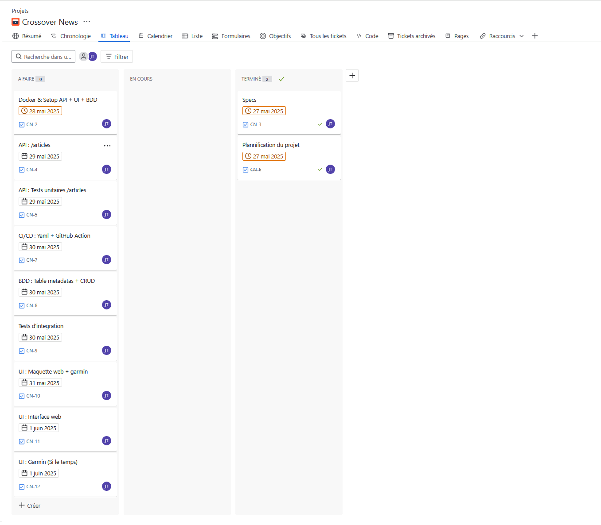

# 📰 Crossover News – README 🇫🇷

<div id="header" align="center" style="display: flex; flex-direction: center; justify-content: center; align-items:center;">
    &nbsp;
    &nbsp;
</div>

## 📑 Sommaire
- [Objectifs du projet](#objectifs-du-projet)
- [Fonctionnement général](#fonctionnement-général)
- [Technologies utilisées](#technologies-utilisées)
- [Backend – Symfony API](#backend--symfony-api)
- [Endpoints](#endpoints)
- [Flux RSS (Sources)](#flux-rss-sources)
- [Exemple de réponse `/articles`](#exemple-de-réponse-articles)
- [Design](#design) 
- [⚠️ Jira - Gestion de projet & planification](#️-jira---gestion-de-projet--planification)
- [Source (Projet fullstack github)](#source-projet-fullstack-github)
- [⚠️ Avertissement – Conditions d’utilisation des flux RSS](#️-avertissement--conditions-dutilisation-des-flux-rss)
- [Versions à venir](#versions-à-venir)

##  Objectifs du projet

Faire du bruit lorsque l'on mange un plat de nouilles sera perçu positivement au Japon, tandis qu'en France cela renverra une image plutôt négative. Dans le premier cas, un observateur extérieur se dirait "Cette personne apprécie vraiment son plat, c'est agréable !". Dans le deuxième, il s'outrerait en pensant que la personne dégustant son plat est mal élevée.<br/>
Ainsi, un même évènement pourra être perçu différemment selon la zone géographique des personnes qui y assistent.

Qu'en est-il de l'actualité internationale ? 

**Crossover News** est une application web fullstack conçue pour observer l'actualité à travers le prisme de plusieurs médias internationaux.
Dans un premier temps, pour le MVP (Minimum Viable Product), cela aura seulement un but pratique en centralisant l'actualité à un même endroit, vers une interface web ou une montre garmin. <br/>
Ensuite, l'application régroupera les differents articles par sujet en s'aidant de NLP (Natural Language Processing) même si leur ton diffère. 
Par exemple, voici deux titres publiés le même jour : <br/>
1 - "Trump affirme que Poutine « est devenu completement fou » après les frappes meutrières en Ukraine" (source : Euronews, 26/05/2025, https://fr.euronews.com/2025/05/26/trump-affirme-que-poutine-est-devenu-completement-fou-apres-des-frappes-meurtrieres-en-ukr ) <br/>
2 - "トランプ大統領　プーチン大統領を非難も具体的な対応は不透明" [traduction : "Bien que le président Trump ait critiqué le président Poutine, sa réaction concréte reste floue"] (source : NHK, 26/05/2025, https://www3.nhk.or.jp/news/html/20250526/k10014816641000.html).<br/>
On remarque ici que le titre de NHK est plus nuancé que celui d'Euronews bien que ces derniers parlent de la même chose !

L’objectif final est donc d’offrir une lecture de l’actualité aussi objective que possible.

##  Fonctionnement général

>  **Centralisation des flux RSS** de médias comme NHK, Euronews, Fox News, CBC ou Al Jazeera, puis à terme, **Regroupement automatique des articles traitant du même sujet** à l’aide du NLP, afin de présenter plusieurs visions d’un même événement.

Les flux d'actualité sont envoyés en push via une **API Rest** vers deux types d'interfaces utilisateur : une **interface web** puis une **montre Garmin**.


##  Technologies utilisées

| Côté | Stack | Rôle |
|------|-------|------|
| Backend | Symfony 7 / PHP 8 | API REST |
| BDD | MySQL | Stockage des métadonnées |
| DevOps | Docker / Docker Compose | Conteneurisation et déploiement |
| CI/CD | GitHub Actions | automatisation des tests, build, etc |
| Frontend (web) | React.js | Interface utilisateur web |
| Frontend (embarqué) | Garmin Connect IQ (Monkey C) | Interface mobilité de consultation |
| Observabilité | Monolog + DB logs | Suivi technique & usages |
| Évolution IA | Python + NLP | Groupement automatique des articles similaires |


##  Backend – Symfony API

###  Endpoints

| Méthode | Route | Description |
|---------|-------|-------------|
| GET | `/articles` | Retourne les derniers articles de plusieurs flux RSS agrégés |
| GET | `/meta` | Retourne les logs métier (source, date, type) avec pagination |

###  Flux RSS (Sources)

| Media                 | Zone         | Category         | RSS URL                                                                 |
|----------------------|--------------|------------------|-------------------------------------------------------------------------|
| Euronews             | EU           | World News       | https://fr.euronews.com/rss?format=mrss&level=theme&name=news          |
| Euronews             | EU           | My Europe        | https://fr.euronews.com/rss?format=mrss&level=vertical&name=my-europe  |
| NHK                  | Japan        | 主要ニュース       | https://www.nhk.or.jp/rss/news/cat0.xml                                 |
| NHK                  | Japan        | 国際              | https://www.nhk.or.jp/rss/news/cat6.xml                                 |
| Fox News             | USA          | World            | https://moxie.foxnews.com/google-publisher/world.xml                   |
| Fox News             | USA          | US               | https://moxie.foxnews.com/google-publisher/us.xml                      |
| CBC News             | Canada       | World News       | https://www.cbc.ca/webfeed/rss/rss-world                               |
| CBC News             | Canada       | Canada News      | https://www.cbc.ca/webfeed/rss/rss-canada                              |
| G1 Globo             | Brazil       | Mundo            | https://g1.globo.com/rss/g1/mundo/                                     |
| G1 Globo             | Brazil       | Brasil           | https://g1.globo.com/rss/g1/brasil/                                    |
| CGTN                 | China        | World            | https://www.cgtn.com/subscribe/rss/section/world.xml                   |
| CGTN                 | China        | China            | https://www.cgtn.com/subscribe/rss/section/china.xml                   |
| The Times of India   | India        | World            | https://timesofindia.indiatimes.com/rssfeeds/296589292.cms             |
| The Times of India   | India        | India            | https://timesofindia.indiatimes.com/rssfeeds/-2128936835.cms           |
| RNZ                  | New Zealand  | World            | https://www.rnz.co.nz/rss/world.xml                                    |
| RNZ                  | New Zealand  | New Zealand      | https://www.rnz.co.nz/rss/national.xml                                 |
| The East African     | Kenya        | Rss              | https://www.theeastafrican.co.ke/rss.xml                               |
| Al Jazeera           | Qatar        | All              | https://www.aljazeera.com/xml/rss/all.xml                               |
| Ukrainska Pravda     | Ukraine      | News             | https://www.pravda.com.ua/eng/rss/view_news/                           |
| The Moscow Times     | Russia       | News             | https://www.themoscowtimes.com/rss/news                                |


###  Exemple de réponse `/articles`
```json
[
    {
        "source": "Euronews[World]",
        "zone": "EU",
        "content": [
            {
                "title": "Droits de douane sur l'acier et l'aluminium : l'UE regrette l'augmentation annoncée par Trump",
                "link": "https://fr.euronews.com/2025/05/31/donald-trump-annonce-une-augmentation-de-50-des-droits-de-douane-sur-lacier-et-laluminium",
                "date": "Sat, 31 May 2025 10:33:46 +0000"
            }
        ]
    },
    {
        "source": "NHK[World]",
        "zone": "Japan",
        "content": [
            {
                "title": "OPECプラス 7月も原油大幅増産へ 原油価格低い水準続く可能性",
                "link": "http://www3.nhk.or.jp/news/html/20250531/k10014822391000.html",
                "date": "Sat, 31 May 2025 14:05:32 +0000"
            }
        ]
    },
    {
        "source": "Fox News[World]",
        "zone": "USA",
        "content": [
            {
                "title": "Huckabee slams French-backed Palestinian statehood push at UN, says US-Israel are 'inseparably' linked",
                "link": "https://www.foxnews.com/world/huckabee-slams-french-backed-palestinian-statehood-push-un-says-us-israel-inseparably-linked",
                "date": "Sat, 31 May 2025 13:19:33 +0000"
            }
        ]
    },
    {
        "source": "CBC News[World]",
        "zone": "Canada",
        "content": [
            {
                "title": "Trump says he plans to double steel and aluminum tariffs",
                "link": "https://www.cbc.ca/news/world/trump-canada-steel-tariffs-1.7548855?cmp=rss",
                "date": "Wed, 14 May 2025 08:01:00 +0000"
            }
        ]
    },
    {
        "source": "G1 Globo[World]",
        "zone": "Brazil",
        "content": [
            {
                "title": "Irã expande atividade nuclear, desafiando 'pressão máxima' dos EUA",
                "link": "https://g1.globo.com/mundo/noticia/2025/05/31/ira-expande-atividade-nuclear-apesar-de-pressao-dos-eua.ghtml",
                "date": "Sat, 31 May 2025 12:05:24 +0000"
            }
        ]
    }
]
```
### ⚠️ Jira - Gestion de projet & planification
https://jeanbaptistetheroulde.atlassian.net/jira/software/projects/CN/boards/3

<div id="header" align="center" style="display: flex; flex-direction: row; justify-content: center; align-items:center;">
    &nbsp;
</div>

### Design
Outil = Figma<br/>
>Maquette version laptop
<div id="header" align="center" style="display: flex; flex-direction: column; justify-content: center; align-items:center;">
    &nbsp;
</div>&nbsp;

Maquette version mobile<br/>
<div id="header" align="center" style="display: flex; flex-direction: column; justify-content: center; align-items:center;">
    &nbsp;
</div>


### Source (Projet fullstack github)
>Ayant très peu de temps pour réaliser cette application, notamment à cause de divers aléas, j'ai choisi de reprendre un projet github déjà fonctionnel et de le modifier directement<br>
>Je peux ainsi me concentrer sur l'aspect fonctionnel et visuel, tel que je le ferais en reprenant un projet déjà en cours en entreprise.<br>
source = https://github.com/IUT-LAVAL-MMI/SymfonyReactOnDocker


### ⚠️ Avertissement – Conditions d’utilisation des flux RSS
Conformément aux [conditions d'utilisation d’Euronews](https://fr.euronews.com/terms-and-conditions), il est strictement interdit de stocker, modifier ou republier leurs contenus sans autorisation écrite préalable.<br/>
**Cette application n’effectue aucun enregistrement ni transformation des flux d’actualités.** Les articles sont récupérés dynamiquement depuis les flux RSS publics fournis par chaque média, et les liens renvoient systématiquement vers les sources officielles.<br/>

Je vous invite à respecter les politiques de chaque média si vous contribuez ou réutilisez ce projet.


>  **Soon**
# 📰 Crossover News – README 🇬🇧 
# 📰 Crossover News – README 🇯🇵
